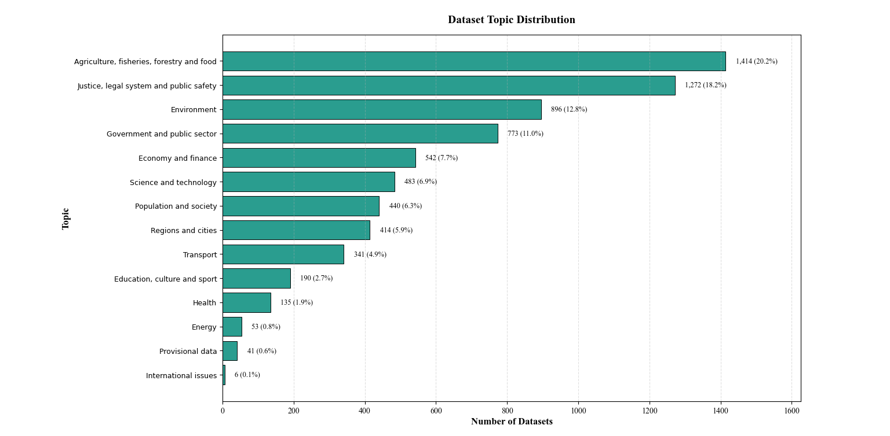
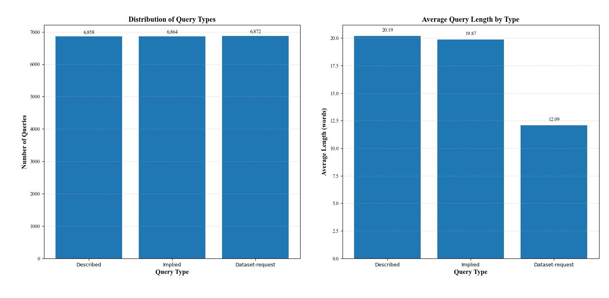
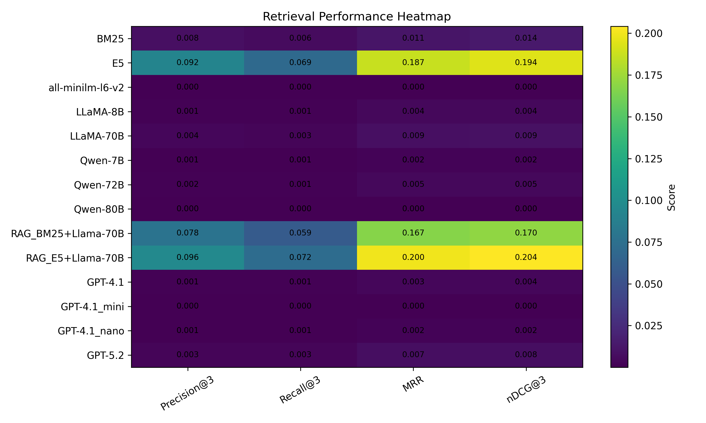

# AHA-Bench: Ad Hoc Dataset Retrieval Benchmark

AHA-Bench is a large-scale benchmark for **ad hoc dataset retrieval in natural language**, grounded in real-world open data from the European Data Portal (data.europa.eu).  
It is designed to evaluate retrieval systems in **exploratory dataset discovery scenarios**, where users express information needs in free-form natural language rather than keyword queries.

---

## 🔍 What Does the Benchmark Look Like?

### Dataset Collection and Topic Distribution

AHA-Bench contains **7,000 real-world datasets** sampled from data.europa.eu across **14 topical domains**.  
To avoid over-representation of dominant categories, datasets are sampled proportionally by topic.

#### Topic Distribution

| Topic | # Datasets | % |
|------|-----------:|---:|
| Agriculture, fisheries, forestry and food | 1,414 | 20.2 |
| Justice, legal system and public safety | 1,272 | 18.2 |
| Environment | 896 | 12.8 |
| Government and public sector | 773 | 11.0 |
| Economy and finance | 542 | 7.7 |
| Science and technology | 483 | 6.9 |
| Population and society | 440 | 6.3 |
| Regions and cities | 414 | 5.9 |
| Transport | 341 | 4.9 |
| Education, culture and sport | 190 | 2.7 |
| Health | 135 | 1.9 |
| Energy | 53 | 0.8 |
| Provisional data | 41 | 0.6 |
| International issues | 6 | 0.1 |
| **Total** | **7,000** | **100** |

  

*Figure 1: Topic distribution of datasets in AHA-Bench.*

---

## 🧠 Query Styles in AHA-Bench

To reflect realistic dataset discovery behavior, queries are generated using an LLM and grounded in a **query intent taxonomy** derived from prior studies of conversational dataset search.

Each dataset is associated with two evaluation queries:

### Query Types

- **Described Queries**  
  Explicitly describe the desired dataset in natural language.  
  *Example:*  
  > “Find a dataset about air pollution levels across European cities.”

- **Implied Queries**  
  Express a problem-oriented information need that presupposes relevant datasets.  
  *Example:*  
  > “How has air quality changed in major European cities over time?”

Dataset-request queries (e.g., queries that explicitly name a dataset) are generated as auxiliary artifacts but **excluded from retrieval evaluation**.

### Query Statistics

| Statistic | Value |
|---------|------:|
| Total number of queries | 20,594 |
| Described queries (evaluation) | 6,858 |
| Implied queries (evaluation) | 6,864 |
| Dataset-request queries (auxiliary) | 6,872 |
| Avg. described query length | 20.19 words |
| Avg. implied query length | 19.87 words |
| Avg. request query length | 12.09 words |

  

*Figure 2: Distribution of query types in AHA-Bench.*
---

## 📊 Benchmark Performance

We evaluate three classes of systems:

1. **Classical retrievers** (BM25, dense embeddings)
2. **Retrieval-free LLMs** (query-only)
3. **Retrieval-augmented LLM systems (RAG)**

Metrics reported: **P@3, R@3, MRR, nDCG@3**

### Main Results

| Model | P@3 | R@3 | MRR | nDCG@3 |
|------|----:|----:|----:|------:|
| **Classical Retrievers** |||||
| BM25 | 0.0083 | 0.0061 | 0.0114 | 0.0140 |
| all-MiniLM-L6-v2 | 0.0000 | 0.0001 | 0.0001 | 0.0001 |
| **E5-large-v2** | **0.0921** | **0.0695** | **0.1873** | **0.1944** |
| **Retrieval-free LLM baselines (query-only)** |||||
| *Open-weight models* |||||
| LLaMA3.1-8B | 0.0014 | 0.0011 | 0.0041 | 0.0041 |
| LLaMA3.1-70B | 0.0036 | 0.0028 | 0.0087 | 0.0092 |
| Qwen2.5-7B | 0.0007 | 0.0006 | 0.0018 | 0.0019 |
| Qwen2.5-72B | 0.0016 | 0.0014 | 0.0045 | 0.0046 |
| Qwen3-80B | 0.0001 | 0.0001 | 0.0002 | 0.0002 |
| *Closed-source models* |||||
| GPT-4.1 | 0.0013 | 0.0010 | 0.0035 | 0.0036 |
| GPT-4.1 mini | 0.0000 | 0.0000 | 0.0001 | 0.0001 |
| GPT-4.1 nano | 0.0006 | 0.0005 | 0.0017 | 0.0018 |
| GPT-5.2 | 0.0031 | 0.0027 | 0.0075 | 0.0079 |
| **Retrieval-augmented systems** |||||
| RAG (BM25) + LLaMA3.1-70B | 0.0776 | 0.0586 | 0.1674 | 0.1702 |
| **RAG (E5-large-v2) + LLaMA3.1-70B** | **0.0957** | **0.0722** | **0.2001** | **0.2042** |

  

*Figure 4: Retrieval performance across model classes.*

**Key takeaway:**  
- Query-only LLMs perform near zero  
- Dense retrieval substantially outperforms BM25  
- Retrieval-augmented LLMs achieve the strongest performance, but the task remains far from saturated

---

## 📦 What’s Included in This Repository

- Dataset metadata (7,000 datasets)
- Natural-language queries (described & implied)
- Graded relevance labels (0–4)
- Baseline retrieval and evaluation code
- Scripts for reproducing benchmark analysis and plots

---

